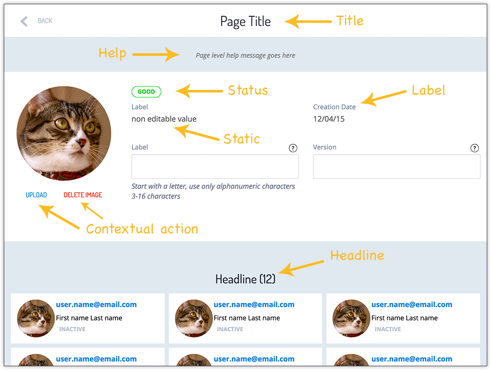

# Typography and Colors

On this guide we are going to learn about Techné Typography elements. How to use them to bring clarity and visual hierarchy to your User experience.

We are going to look at the colors available on Techné. How these colors are used and which elements can have different colors to reflect different uses.

## Index

* Types of text
* Text visual hierarchy
* Main and secondary colors
* Buttons and their colors
* Icons colors
* Background  and frames colors

## Types of text

Usual User Experiences build using Techné use Typography and text size as a way to represent visual hierarchy. This makes easier to understand, navigate and use the interface.

Let's take a look at the screenshot bellow

As you can see we have different styles for different kinds of textual information:
* **Title**: The page title is located on the [ActionBar](patterns/Action-Bar.html) and should communicate clearly what this particular page is about. This text is one of the most prominent on the page and it is visible at all times.
* **Help**: The Page Help is displayed bellow the [ActionBar](patterns/Action-Bar.html) and explains very simple what the user can do on this page. In other words it complements the **Title** of the page. This text is styled as the rest of "help text" on Techné: in italics.
* **Status**: The text displayed on the [Status Indicator](/components/Status-Indicators.html) is used to display the current status of a given element. Statuses can be: Active, Inactive; Published, Unpublished; Received, In Process, Shipped; or any other state that change through time. The Status Indicators are displayed surrounded by a round border and have a [distinctive color](/components/Status-Indicators.html) to give extra emphasis and draw the attention of the user.
* **Static**: The static text is the common text you can use to display information that don't change. It has no text style and a contrasting color.
* **Label**: Labels are always displayed along a [form element](components/Form-Elements.html), or static text. It reflects what the related form element or static text is about. The font size and style are a little muted so the user can focus on data input or reading the static text.
* **Contextual Actions**: These actions are always displayed nearby the object to be modified. Style is all caps and different color to make them different from the normal text on screen.
* **Headlines**: Headlines are used to give some hierarchy to the screen, separating the different parts. The font size is bigger so it have more visual weight on the overall page visual hierarchy.

## Text visual hierarchy

From the screenshot above you can see Text is used to give the page a Visual Hierarchy and at the same time to separate the different areas of the screen. The main text element used to accentuate the visual hierarchy are the Headlines.

